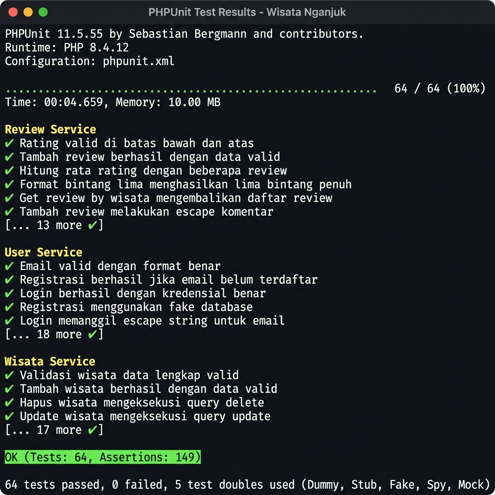

# 🌍 Wisata Nganjuk Web App


Aplikasi web **Wisata Nganjuk** merupakan sistem informasi yang menampilkan:
- 🌄 Destinasi Wisata
- 🍜 Kuliner Khas
- 🎉 Event Daerah

Dilengkapi dengan **dashboard admin CRUD**, tampilan modern seperti website *Wonderful Indonesia*, serta **unit test** menggunakan PHPUnit.

---

## ✨ Fitur Utama

### 👥 User
- Melihat daftar wisata, kuliner, dan event
- Detail informasi lengkap (gambar, lokasi, deskripsi)
- Tampilan UI modern & responsif
- Slider interaktif (premium style)

### 🔐 Admin
- Login sistem
- CRUD data: Wisata, Kuliner, Event
- Upload gambar
- Manajemen data berbasis database

### 🧪 Unit Test
- 56 test cases menggunakan **PHPUnit 11**
- 5 tipe test double: **Dummy, Stub, Fake, Spy, Mock**
- Teknik: **Equivalence Partitioning** & **Boundary Value Analysis**

---

## 🛠️ Teknologi yang Digunakan

| Kategori | Teknologi |
|----------|-----------|
| Frontend | HTML, CSS, Bootstrap 5 |
| Backend | PHP Native |
| Database | MySQL |
| Testing | PHPUnit 11 |
| Version Control | GitHub |

---

## 📁 Struktur Project

```
wisata-nganjuk/
├── admin/          # Halaman admin (CRUD)
├── api/            # API endpoint (review, favorit)
├── assets/         # CSS, JS, gambar
├── src/            # Service classes (testable)
│   ├── Database.php
│   ├── UserService.php
│   ├── WisataService.php
│   └── ReviewService.php
├── tests/          # Unit test
│   ├── TestDoubles.php
│   ├── UserServiceTest.php
│   ├── WisataServiceTest.php
│   └── ReviewServiceTest.php
├── composer.json
├── phpunit.xml
├── config.php
└── index.php
```

---

## 🧪 Unit Testing

Project ini menggunakan **PHPUnit 11** dengan berbagai teknik pengujian:

### Test Double yang Digunakan

| Test Double | Kelas | Kegunaan |
|-------------|-------|----------|
| **Dummy** | `DummyDatabase` | Memenuhi parameter, tidak dipakai dalam test |
| **Stub** | `DatabaseStub` | Mengembalikan data tetap/hard-coded |
| **Fake** | `FakeDatabase` | Implementasi in-memory pengganti database |
| **Spy** | `DatabaseSpy` | Merekam interaksi (query yang dieksekusi) |
| **Mock** | PHPUnit `createMock()` | Verifikasi pemanggilan metode secara ketat |

### Teknik Pengujian

- **Equivalence Partitioning** — Membagi input ke partisi valid/tidak valid
- **Boundary Value Analysis** — Menguji nilai tepat di batas (misal: password min 6 karakter, rating 1–5)

### Menjalankan Test

```bash
# Install dependencies
composer install

# Jalankan semua test
vendor/bin/phpunit

# Jalankan dengan output detail
vendor/bin/phpunit --testdox

# Filter berdasarkan group
vendor/bin/phpunit --group validasi
vendor/bin/phpunit --group mock
vendor/bin/phpunit --group spy
```

### Hasil Test

```
PHPUnit 11.x

UserServiceTest       23 tests  ✓
WisataServiceTest     20 tests  ✓
ReviewServiceTest     18 tests  ✓

Total: 64 tests, 149 assertions — OK (64 tests)
```



---

## ⚙️ Cara Menjalankan Project

### 1. Clone Repository

```bash
git clone https://github.com/liytio/DPL.git
cd DPL
```

### 2. Setup Database

- Buat database `wisata-nganjuk` di MySQL/phpMyAdmin
- Import file SQL (jika tersedia)
- Sesuaikan konfigurasi di `config.php`:

```php
$conn = mysqli_connect("localhost", "root", "", "wisata-nganjuk");
```

### 3. Jalankan dengan Web Server

- Gunakan **Laragon**, **XAMPP**, atau **WAMP**
- Akses via browser: `http://localhost/DPL`

### 4. Akses Admin

- URL: `http://localhost/DPL/admin/login.php`

---

## 👨‍💻 Kontributor

Proyek ini dibuat sebagai tugas kelompok mata kuliah **Dasar Pemrograman Lanjut (DPL)**.

---

## 📄 Lisensi

Distributed under the MIT License.